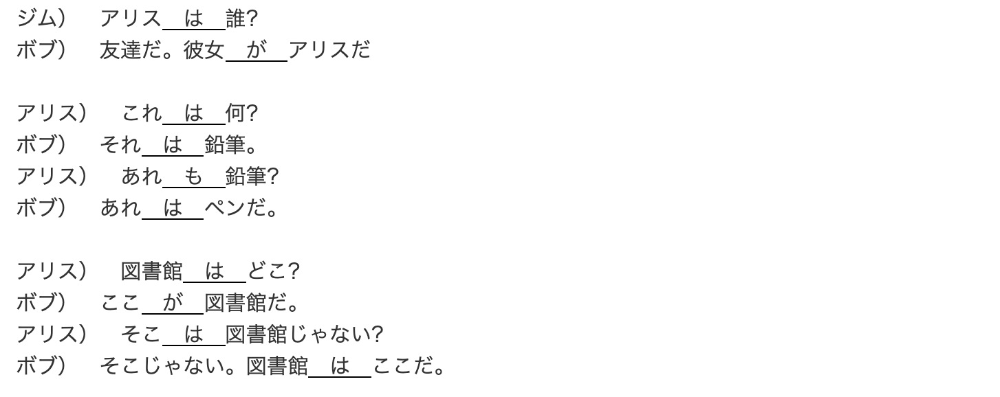

## 助词

> 日语中助词是指黏着到单词末尾来定义其在句中语法功能的平假名。

- 「か」
  1. 句尾提示疑问
    - あなたは小野さんです**か**
  2. 或者
    - 私は毎朝パン**か**お粥を食べる

- 「に」
  1. **动作**发生的**具体**时间
    - 私は六時**に**起きます
    - 何時**に**起きますか
  2. **静态**存在句
    - ここ**に**机があります/机はここ**に**あります
  3. 动作涉及的对象
    - 私は田中さん**に**花をあげる/田中さんは私**に(から)**花をもらう
    
- 「と」
  1. 提示并列 "和",完全列举
    - 部屋にテレビ**と**ビデオがあります
  2. 动作共同者 "和,与"
    - 小野さんは友達**と**一緒に帰りました

- 「へ」（え）
  1. 动作的行为方向
    - 吉田さんは中国**へ**行きます (也可以使用に)

- 「から」
  1. 时间/空间起点
    - 私は9時**から**働きます
    - 李さんは北京**から**来ました
    - どこ**から**来ましたか
  2. 原因
    - 森さんはお酒が好きです(だ)**から**、毎日飲みます

- 「まで」
  1. 时间/空间终点
    - 森さんはにじ**まで**勉強します
    - 森さんは広島**まで**新幹線で行きます

- 「を」（お）
  1. 提示宾语
    - 李さんはコーヒー**を**飲みます
    - 水**を**ください
  2. 离开、移动、经过、的地点
    - 大学**を**卒業(そつぎょう)する
    - 橋**を**渡る（わたる）
    - 道（みち）**を**歩く（あるく）

- 「の」
  1. 从属
    - 李さんはJC企画の社員です
  2. 所属
    - 私の鍵/アメリカの車/日本人の先生（同位语）

- 「も」
  1. 包含主题助词, 包含主题助词是一个跟主题助词非常相似的助词。它其实就是一个带了「也」意思的主题助词. 使用「も」要注意一致性，不能说「我是学生，Tom 也不是学生。」。
    - ここ**も**JC企画のビルです
  2. 疑问词+も+动词(否定)
    - 教室に誰**も**いません
    
- 「や」
  1. 连接词,不完全列举,常和など一起使用
    - 吉田さんは時々（ときどき）中国**や**韓国へ行きます

- 「で」
  1. 方式方法范围状态 by in at with

- 「ね」
  1. 祈求对方赞同,放在句尾

- 「よ」
  1. 提醒,警告,放在句尾

- 「は」
  1. 表示主题助词-主题语助词可以让我们表明句子在谈论什么，它就是「は」。虽然在五十音图里面这个假名读作 / ha /，但当且仅当作为主题语助词的时候它要读作 / wa /。
  2. 存在句 は...に...ある
  3. 对比、强调、否定　お父さんの部屋に電話はあります
  4. 替换を
  和其他组词组合时放在后面 

- 「が」- 识别助词
  * 这个助词表明了说话的人想要认清楚的东西 は：「谁是那个学生吗？」 -> が：「那个学生是谁？」
  * 助词「が」用来识别某物或某人的属性，而助词「は」只是用来带出一个新的话题。
  * e.g. ブは魚が好きだ

